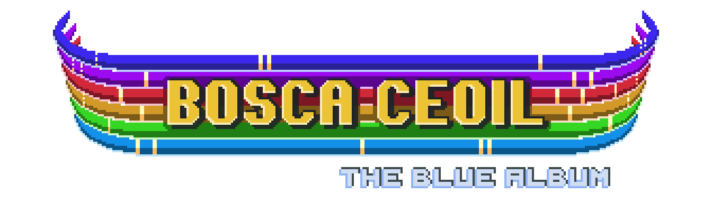

	

# Bosca Ceoil: The Blue Album

**Bosca Ceoil: The Blue Album** (or _Bosca Ceoil Blue_, for short) is a simple and beginner-friendly music making app. Using a step sequencer you can create anything from a simple beat to a complex melodic piece — with huge selection of synthesized instruments!

_Bosca Ceoil Blue_ is a modern port of **Terry Cavanagh's [Bosca Ceoil](https://github.com/TerryCavanagh/boscaceoil)**, and attempts to preserve everything that made the original so approachable and intuitive. And just like the original, _Bosca Ceoil Blue_ is absolutely free and provided under a permissive open source license, should you need to modify it.

## Features

### Playful and intuitive pattern editor

Begin writing music quickly with a playful piano roll sequencer. Create patterns of notes and experiment with timing and tonality to find your unique sound. Adjust the scale to give yourself a constraint that ensures your music always sounds great!

### Drag'n'drop-based compositor and arrangement editor

Just as playfully rearrange your patterns on the timeline, create variations and make adjustments. Use up to 8 channels to play multiple patterns and instruments in parallel. Block by block, build your multi-minute song!

### Over 300 synthesized instruments

Powered by a versatile software synthesizer, _Bosca Ceoil Blue_ offers you pretty much any instrument you can think of! Don't like how your tune sounds with a piano? Swap it for a guitar with a swift adjustment. If you feel adventurous, make sure to take a look at instrument tuning.

### Ready for production and consumption

Export your creations to WAV and MIDI. Share them with the world, or use them for your next game or video!

## Download

**_Bosca Ceoil Blue_ is currently in the _beta_ phase!** This means it's feature complete and is looking for users and testers to offer feedback and validate its stability.

If you find a usability issue or a bug, please [file a report](https://github.com/YuriSizov/boscaceoil-blue/issues). If you don't have a GitHub account, you can also reach out on [Discord](https://discord.gg/S657Y9KPF9).

### Current release: 3.0-beta2

* **[Download for Linux (x86_64)](https://github.com/YuriSizov/boscaceoil-blue/releases/download/3.0-beta2/boscaceoil-blue-linux-x86_64.zip)**
* **[Download for macOS (Universal)](https://github.com/YuriSizov/boscaceoil-blue/releases/download/3.0-beta2/boscaceoil-blue-macos-universal.zip)**
* **[Download for Windows (x86_64)](https://github.com/YuriSizov/boscaceoil-blue/releases/download/3.0-beta2/boscaceoil-blue-windows-x86_64.zip)**
* **[Download for Windows (x86_32)](https://github.com/YuriSizov/boscaceoil-blue/releases/download/3.0-beta2/boscaceoil-blue-windows-x86_32.zip)**

_Web and Android versions are planned in the future._

## Contributing

Your participation is welcome!

Whether you can test the project and report bugs, or you can work on improvements and missing features, please don't hesitate to reach out.

- For bugs, please consider creating a bug report in the [Issues](https://github.com/YuriSizov/boscaceoil-blue/issues) section of this repository.
- For features, please start a thread in the [Discussion](https://github.com/YuriSizov/boscaceoil-blue/discussions) section of this repository.
- For work coordination, and just to chat about the project, please join our [Discord server](https://discord.gg/S657Y9KPF9).

The project is being developed using the latest available build of **Godot 4.3**. As this version of the engine is still unstable, some bugs unrelated to this project must be expected.

To work on _Bosca Ceoil Blue_ you need to:

- Check out this repository, or download it as a ZIP archive.
- Get the [latest release of GDSiON 0.7](https://github.com/YuriSizov/gdsion/releases) and extract it into the `bin` folder in the project root.
- Open and edit the project with [Godot 4.3](https://godotengine.org/download/archive/#4.3).

## FAQ

### Is _Bosca Ceoil Blue_ compatible with the original?

Yes, the new version is fully compatible with the original _Bosca Ceoil_ and should be perceived as the next major release in the series. In fact, the first release of _The Blue Album_ is versioned `3.0` to indicate just that. This version should sound the same, loads all existing `.ceol` files, and has every feature of the original.

This also means that tracks created with _The Blue Album_ `3.x` can be loaded back into the original _Bosca Ceoil_, if you so desire. Future releases of _Bosca Ceoil Blue_ are likely to introduce changes and features incompatible with the original, whenever that might be necessary. However, you will always be able to open and edit existing `.ceol` files in every future version of the tool, with your songs being automatically converted to the newest format.

### Why _Bosca Ceoil_ needs a port?

Original _Bosca Ceoil_ is a great tool for budding musicians and game developers. It's almost perfect, but can still benefit from some UX enhancements and improvements to its composing features. It's also using an outdated technology stack which makes it hard to impossible to run it on modern systems, namely macOS and web.

The goal of the _Bosca Ceoil Blue_ project is to make _Bosca Ceoil_ more accessible to today's users and also to new contributors. We achieve this by reimplementing the entire application with a more modern set of tools, as a [Godot engine](https://godotengine.org/) project.

A general-purpose game engine like Godot gives the project means to run on Linux, macOS, and Windows, as well as on web and even mobile phones — almost hassle-free. It's also a popular tool among many game developers, which should make _Bosca Ceoil Blue_ an inviting project for new collaborators.

## License

This project is provided under an [MIT license](LICENSE). Original Bosca Ceoil application is provided under a [BSD-2-Clause-Views license](https://github.com/TerryCavanagh/boscaceoil/blob/da4cedf00c766101f4c7d3a48f1608fc8fd44659/README.md).

## Support

You can support the project financially by donating via [Patreon](https://www.patreon.com/YuriSizov)! Every dollar helps, so please consider donating even if it's a little. Thank you very much <3
